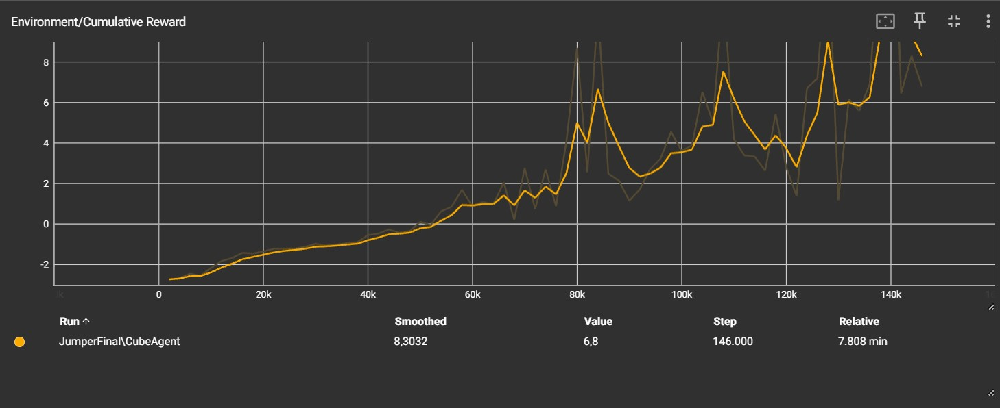

# Jumper Exercise
## Tutorial 
- set-up: A platforming environment where the agent can jump over a moving object. 
- goal: The goal is to create a self-learning agent that is able to avoid obstacles by jumping over them. The agent is confronted with a row of continuously moving obstacles, with each obstacle having a different speed. The ultimate goal is to train the agent so that he can respond efficiently and effectively to the variable speeds of the obstacles and successfully avoid them.
- Agents: The environment contains one agent.
- Agent Reward Function:
    - +1 when he jumps over
    - -0,1 with every jump
    - -1 if the agent gets hit by the moving object
- Behavior Parameters:
    - Vector Observation space: 20 ray casts detecting 1 object
    - Visual Observations: None
    - Actions: 1 discrete action branche:
        - Jump (2 possible actions: Jump, No jump)
- Benchmark Mean Reward: 

## Tensorboard 
