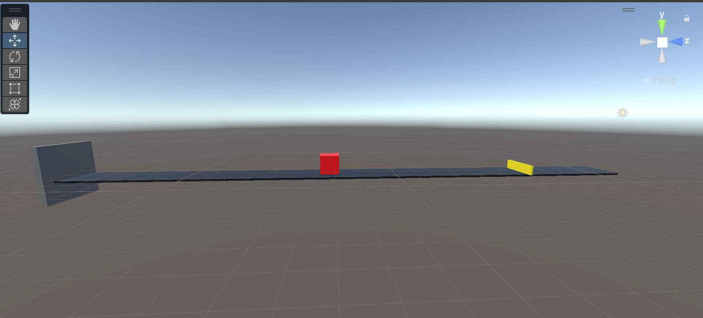

# Jumper Exercise
## Basics
- set-up: A platforming environment where the agent can jump over a moving object. 
- goal: The goal is to create a self-learning agent that is able to avoid obstacles by jumping over them. The agent is confronted with a row of continuously moving obstacles, with each obstacle having a different speed. The ultimate goal is to train the agent so that he can respond efficiently and effectively to the variable speeds of the obstacles and successfully avoid them.
- Agents: The environment contains one agent.
- Agent Reward Function:
    - +1 when he jumps over
    - -0,1 with every jump
    - -1 if the agent gets hit by the moving object
- Behavior Parameters:
    - Vector Observation space: 20 ray casts detecting 1 object
    - Visual Observations: None
    - Actions: 1 discrete action branche:
        - Jump (2 possible actions: Jump, No jump)
- Benchmark Mean Reward: 8.3032

## Tutorial 
### General setup
When unity is opened, you need to create a scene with the setup below. This consists of a agent (red) and the track with a wall at the end. Voor de muur (a cube) moet je een nieuwe tag aanmaken, genaamd "colliderwall". In addition, you should also make a prefab of a cube (yellow), which serves as an obstacle. You also give this one a tag "obstacle". This cube should not be in the starting setup, you should only have a prefab of this. 

### Agent 
Give the agent: 
- Box collider: 
    
- Rigidbody: 
    
- Behavior Parameters:
    

## Tensorboard 

Early in the training, the agent showed significant flaws, with frequent errors and a lack of consistency. Almost every episode, there were at least five moments when the agent missed the jump and could not avoid the moving bars. However, over time, the agent's performance appeared to improve significantly. By the end of the learning process, errors were almost non-existent and the agent was able to jump almost perfectly, with a significantly reduced number of failed attempts.